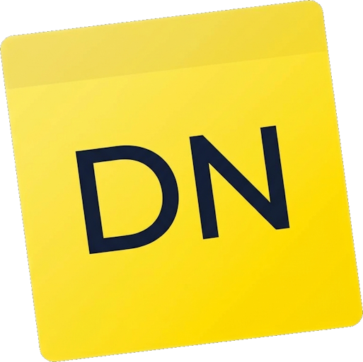

# DeskNotes

Minimalistische Desktop-Notizliste für Windows — offline, schnell, immer griffbereit im Tray.

<p align="center">
  
</p>


## Features

- **Notizen** — anlegen, bearbeiten, abhaken, löschen, per Drag & Drop sortieren
- **Markdown** — `**fett**`, `*kursiv*`, Links, Listen und Inline-Code in Notizen
- **Filter** — Alle, Aktiv, Erledigt
- **Tray-Icon** — App läuft im Hintergrund, Schließen minimiert ins Tray
- **Globaler Hotkey** — `Strg + Alt + Leertaste` öffnet die Eingabe von überall
- **Autostart** — optional mit Windows starten
- **Immer im Vordergrund** — optional aktivierbar
- **Addon-System** — erweiterbar über DLLs im `Addons/`-Ordner

### Addons (mitgeliefert)

| Addon | Beschreibung | Kurzbefehl |
|-------|--------------|------------|
| **Export** | Notizen als JSON oder Markdown exportieren | Tray-Menü |
| **Timer** | Fokus-Timer mit Sound-Profilen | `timer`, `timer 25`, `timer stop` |
| **Confetti** | Konfetti beim Abhaken einer Notiz | Einstellungen |
| **Disco** | Disco-Modus | `disco` |

## Voraussetzungen

- Windows 10 oder 11 (64-bit)
- Keine separate .NET-Installation nötig — der Installer enthält alles

## Installation

### Download (empfohlen)

1. [GitHub Release](https://github.com/kptnChr7s/DeskNotes/releases/latest) öffnen
2. **`DeskNotes-Setup-x.x.x-win-x64.exe`** herunterladen (eine einzelne Datei)
3. Doppelklick → Installations-Assistent → **Weiter / Installieren** → fertig

Kein ZIP entpacken, kein Ordner manuell kopieren. Die App landet im Startmenü (optional Desktop-Verknüpfung). Deinstallation über Windows → „Installierte Apps“.

### Aus dem Quellcode bauen

```powershell
git clone https://github.com/kptnChr7s/DeskNotes.git
cd DeskNotes
dotnet build DeskNotes.sln -c Release
```

Die App liegt danach unter `bin\Release\net10.0-windows\DeskNotes.exe`.

### Installer lokal bauen

[Inno Setup 6](https://jrsoftware.org/isinfo.php) installieren, dann:

```powershell
.\installer\build-installer.ps1
```

Ausgabe: `installer\output\DeskNotes-Setup-1.0.0-win-x64.exe`

## Datenspeicherung

Alle Daten werden lokal gespeichert — keine Cloud, kein Account:

| Datei | Inhalt |
|-------|--------|
| `%LocalAppData%\DeskNotes\todo.json` | Notizen |
| `%LocalAppData%\DeskNotes\settings.json` | Fenster, Filter, Einstellungen |
| `%LocalAppData%\DeskNotes\addons\` | Addon-Einstellungen |

## Tastenkürzel

| Taste | Aktion |
|-------|--------|
| `Enter` | Notiz hinzufügen / speichern |
| `Entf` | Ausgewählte Notiz löschen |
| `Doppelklick` | Notiz bearbeiten |
| `Esc` | Bearbeitung abbrechen / App minimieren |
| `Strg + Alt + Leertaste` | App öffnen (global) |

## Projektstruktur

```
DeskNotes/
├── DeskNotes.csproj          # Hauptanwendung (WPF)
├── DeskNotes.Abstractions/   # Addon-Interfaces & Events
├── Addons/                   # Addon-Projekte
│   ├── DeskNotes.Addon.Export/
│   ├── DeskNotes.Addon.Timer/
│   ├── DeskNotes.Addon.Confetti/
│   └── DeskNotes.Addon.Disco/
├── Core/Addons/              # Addon-Host, Loader, EventBus
├── ViewModels/               # MVVM
├── Services/                 # Persistenz, Hotkey, Autostart
└── Themes/                   # Dark-Theme Styles
```

## Lizenz

MIT — siehe [LICENSE](LICENSE).